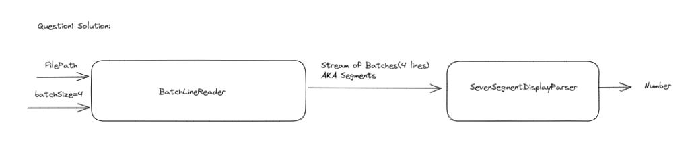

# Taboola home assignment Solutions

### **Build**
to build the project run the following command from root project :

     ./gradlew clean build

the uber jar will be placed in `build/libs/taboola_solution.jar`

### **Run**
command for running the java program:

     java -jar build/libs/taboola_solution.jar <question_number>   

to run the first question solution `<question_number> = 1` otherwise solution 2 will run.

## Design notes
### Question1 Design

- The parser is the main component in that solution, the way it works is it flattening each 3 columns in a single line, and then transform it to a digit, for each 3 columns.
    - hence I made some assumptions to make it simple (which were approved):
        - the number of columns is divisible by 3.
        - the number of lines are devisable by 4.
        - each segment is represented as 4 lines, and can fit into memory
- the design is parsing files in serial manner by reading batches of 4 lines , just as an MVP for the solution, this can be easily be generalized to other big data framework/library that divide the load between cluster of nodes. The parser is basically a pure function from `String` to `String`.

### Question 2 Design:
- As requested I used `ConcurrentHashMap` to count the frequency of words in several file paths as input. The Map is mapping from token to it's frequency using `LongAdder` as a thread safe counter, to count in a concurrent manner without using locks - this should improve performance dramatically.
- each file is processed in parallel using `ExecutorSerivce` when calling the `load(files)` method.
- when calling to `displayStatus()` it will block final result is ready , and the result will be written to a general `Writer` (by default it is the output channel).
- used `computeIfAbsent` instead of `putIfAbsent` which is more suitable.

#### General notes:
- The coverage of the tests are on the important logic
- The tests do not use any IO (except with question 2 which was a must according to requirements) to cover important cases and have feedback loop that is very fast.

